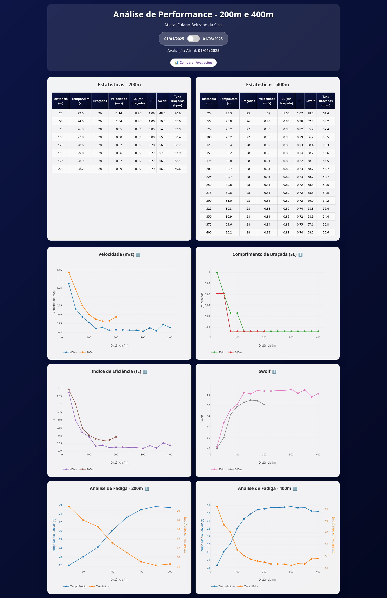
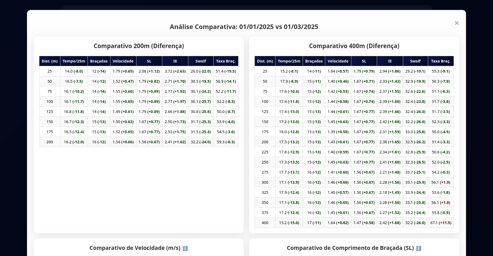
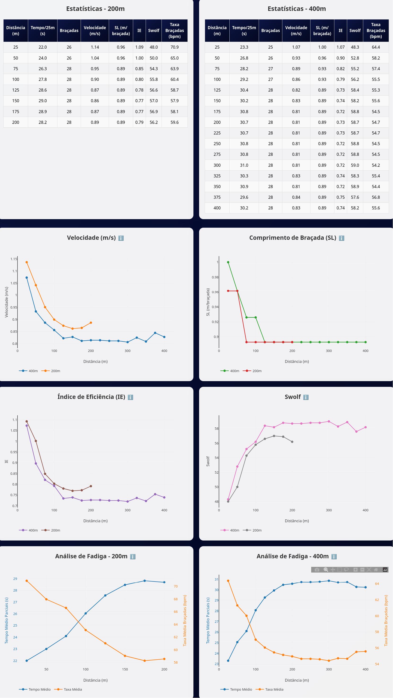

# 🏊‍♂️ Swimming Performance Analysis Dashboard

## 📊 Visão Geral do Projeto

Dashboard interativo para análise comparativa de performance em natação, desenvolvido para acompanhar a evolução técnica e física de atletas em provas de 200m e 400m. O projeto combina visualização de dados avançada com métricas específicas do esporte para fornecer insights acionáveis sobre performance aquática.



## 🎯 Objetivos

- **Monitoramento de Performance**: Análise detalhada de métricas técnicas ao longo de diferentes distâncias;
- **Comparação Temporal**: Visualização da evolução entre diferentes avaliações;
- **Análise de Fadiga**: Identificação de padrões de deterioração da performance durante a prova;
- **Insights Técnicos**: Cálculo de indicadores específicos como IE (Índice de Eficiência) e Swolf.

## 🔧 Tecnologias Utilizadas

### Frontend
- **HTML5/CSS3**
- **JavaScript ES6**
- **Plotly.js**

### Backend/Análise
- **Python 3.8+**
- **Pandas**
- **Plotly**

### Design
- **CSS Grid/Flexbox**
- **Glassmorphism**
- **Gradientes**

## 📈 Métricas Analisadas

| Métrica | Descrição | Importância |
|---------|-----------|-------------|
| **Velocidade** | Ritmo de deslocamento (m/s) | Indica performance bruta |
| **SL (Stroke Length)** | Distância por braçada | Mede eficiência técnica |
| **IE (Índice de Eficiência)** | Velocidade × SL | Combina força e técnica |
| **Swolf** | Tempo + Número de braçadas | Eficiência geral |
| **Taxa de Braçadas** | Frequência de braçadas (bpm) | Indica cadência |
| **Análise de Fadiga** | Médias móveis de tempo/cadência | Resistência ao longo da prova |

## 🚀 Funcionalidades

### Dashboard Principal
- ✅ **Visualização Dupla**: Análise simultânea de 200m e 400m
- ✅ **Switch Temporal**: Alternância entre avaliações com transições suaves
- ✅ **Tabelas Dinâmicas**: Dados organizados por parciais de 25m
- ✅ **Gráficos Interativos**: Hover details e zoom personalizado

### Modal Comparativo
- ✅ **Análise Diferencial**: Comparação direta entre períodos
- ✅ **Código de Cores**: Verde para melhorias, vermelho para regressões
- ✅ **Gráficos Sobrepostos**: Visualização clara das tendências
- ✅ **Métricas de Fadiga**: Análise específica de resistência

### UX/UI Features
- ✅ **Design Responsivo**: Adaptação para mobile e desktop
- ✅ **Tooltips Informativos**: Explicações contextuais das métricas
- ✅ **Animações Suaves**: Transições fluidas entre estados
- ✅ **Proteção por Senha**: Sistema básico de autenticação

## 📁 Estrutura do Projeto

```
src/
├── dashboard.html          # Interface principal do dashboard
├── analysis.py            # Scripts de análise em Python
data/
├── sample_data.json       # Dados de exemplo estruturados
docs/
└── screenshots/           # Imagens para documentação
```

## 🔍 Como Usar:

### Método 1: Dashboard Web
```bash
# Clone o repositório
git clone https://github.com/seu-usuario/swimming-performance-analysis.git

# Abra o arquivo HTML em um navegador
open src/dashboard.html
```

### Método 2: Análise Python
```bash
# Instale as dependências
pip install -r requirements.txt

# Execute a análise
python src/analysis.py
```

## 📊 Exemplos de Insights

### Evolução da Performance
- **Velocidade média 200m**: Melhoria de 18% entre avaliações.
- **Eficiência técnica (IE)**: Aumento significativo em todas as distâncias.
- **Swolf**: Redução consistente, indicando melhor eficiência geral.

### Análise de Fadiga
- **200m**: Manutenção da cadência ao longo da prova.
- **400m**: Melhoria na resistência à fadiga técnica.
- **Padrão de braçadas**: Maior estabilidade na segunda avaliação.

## 🎨 Screenshots

| Funcionalidade | Preview |
|----------------|---------|
| Dashboard Principal |  |
| Modal Comparativo |  |
| Gráficos Interativos |  |

## 🔄 Próximas Iterações

- [ ] **Integração com APIs**: Conexão com dispositivos de natação
- [ ] **Machine Learning**: Predição de performance baseada em histórico
- [ ] **Relatórios PDF**: Exportação automatizada de análises
- [ ] **Multi-atleta**: Comparação entre diferentes nadadores
- [ ] **Análise de Vídeo**: Correlação com dados biomecânicos

## 🤝 Contribuições

Contribuições são bem-vindas! Por favor:

1. Fork o projeto
2. Crie uma branch para sua feature (`git checkout -b feature/AmazingFeature`)
3. Commit suas mudanças (`git commit -m 'Add some AmazingFeature'`)
4. Push para a branch (`git push origin feature/AmazingFeature`)
5. Abra um Pull Request

## 👨‍💻 Desenvolvedor

**Vitor Anfrizio**
- 📧 Email: vitoranfrizio@hotmail.com
- 💼 LinkedIn: [linkedin.com/in/vitoranfrizio](https://www.linkedin.com/in/vitoranfrizio/)
- 🐙 GitHub: [@vitoranfrizio](https://https://github.com/vitoranfrizio)

---

> *"Dados transformam intuição em estratégia, e estratégia em resultados."*

**Tags:** `data-analysis` `sports-analytics` `swimming` `performance-tracking` `dashboard` `plotly` `python` `javascript` `data-visualization`
